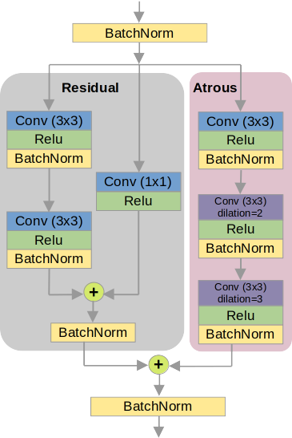

# MetaFormer and CNN Hybrid Model for Polyp Image Segmentation
Authors : [Hyunnam Lee](mailto:hyunnamlee@gmail), [Joohan Yoo](mailto:)

## RAPUNet Architecture


## RAPU Component


## Running the project
### Implementation Environments
Python 3.8.10
Tensorflow 2.13.0

### Data-Sets

The datasets used in this study are publicly available at: 
- Kvasir-SEG: [here](https://datasets.simula.no/kvasir-seg/). 
- CVC-ClinicDB: [here](https://polyp.grand-challenge.org/CVCClinicDB/). 
- ETIS-LaribpolypDB: [here](https://drive.google.com/drive/folders/10QXjxBJqCf7PAXqbDvoceWmZ-qF07tFi?usp=share_link). 
- CVC-ColonDB: [here](https://drive.google.com/drive/folders/1-gZUo1dgsdcWxSdXV9OAPmtGEbwZMfDY?usp=share_link).

You can also download Train/Test datasets seperated by Pranet
- [Google Drive Link (327.2MB)](https://drive.google.com/file/d/1Y2z7FD5p5y31vkZwQQomXFRB0HutHyao/view?usp=sharing). It contains five sub-datsets: CVC-300 (60 test samples), CVC-ClinicDB (62 test samples), CVC-ColonDB (380 test samples), ETIS-LaribPolypDB (196 test samples), Kvasir (100 test samples).
    
- [Google Drive Link (399.5MB)](https://drive.google.com/file/d/1YiGHLw4iTvKdvbT6MgwO9zcCv8zJ_Bnb/view?usp=sharing). It contains two sub-datasets: Kvasir-SEG (900 train samples) and CVC-ClinicDB (550 train samples).

### Training
```pyhon test.py```

## Result
### Qualitative Results


## Citation

## License

The source code is free for research and education use only. Any comercial use should get formal permission first.
