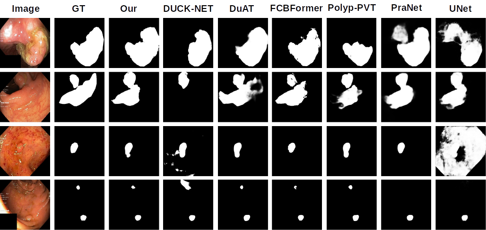

# MetaFormer and CNN Hybrid Model for Polyp Image Segmentation
Authors : [Hyunnam Lee](mailto:hyunnamlee@gmail), [Joohan Yoo](mailto:)

This is the official implementation.

## Introduction
Transformer-based methods have become dominant in the medical image research field since the Vision Transformer achieved superior performance. Although transformer-based approaches have resolved long-range dependency problems inherent in Convolutional Neural Network (CNN) methods, they struggle to capture local detail information. Recent research focuses on the robust combination of local detail and semantic information. To address this problem, we propose a novel transformer-CNN hybrid network named RAPUNet. The proposed approach employs MetaFormer as the transformer backbone and introduces a custom convolutional block, RAPU (Residual and Atrous Convolution in Parallel Unit), to enhance local features and alleviate the combination problem of local and global features. We evaluate the segmentation performance of RAPUNet on popular benchmarking datasets for polyp segmentation, including Kvasir-SEG, CVC-ClinicDB, CVC-ColonDB, EndoScene-CVC300, and ETIS-LaribPolypDB. Experimental results show that our model achieves competitive performance in terms of mean Dice and mean IoU. Particularly, RAPUNet outperforms state-of-the-art methods on the CVC-ClinicDB dataset. 
## RAPUNet Architecture


## RAPU Component


## Running the project
### Implementation Environments
Ubuntu 20.04
Python 3.8.10
Tensorflow 2.13.0

### Data-Sets

The datasets used in this study are publicly available at: 
- Kvasir-SEG: [here](https://datasets.simula.no/kvasir-seg/). 
- CVC-ClinicDB: [here](https://polyp.grand-challenge.org/CVCClinicDB/). 
- ETIS-LaribpolypDB: [here](https://drive.google.com/drive/folders/10QXjxBJqCf7PAXqbDvoceWmZ-qF07tFi?usp=share_link). 
- CVC-ColonDB: [here](https://drive.google.com/drive/folders/1-gZUo1dgsdcWxSdXV9OAPmtGEbwZMfDY?usp=share_link).

You can also download Train/Test datasets seperated by Pranet
- [Google Drive Link (327.2MB)](https://drive.google.com/file/d/1Y2z7FD5p5y31vkZwQQomXFRB0HutHyao/view?usp=sharing). It contains five sub-datsets: CVC-300 (60 test samples), CVC-ClinicDB (62 test samples), CVC-ColonDB (380 test samples), ETIS-LaribPolypDB (196 test samples), Kvasir (100 test samples).
    
- [Google Drive Link (399.5MB)](https://drive.google.com/file/d/1YiGHLw4iTvKdvbT6MgwO9zcCv8zJ_Bnb/view?usp=sharing). It contains two sub-datasets: Kvasir-SEG (900 train samples) and CVC-ClinicDB (550 train samples).

### Training
```pyhon train.py```

### Test with pretrained model
```pyhon test.py```

### Generate predict images
```pyhon predict_img.py```

## Result
### Qualitative Results


## Pretrained Model
 - Trained on Kvasir-SEG: [Naver Link(504.2M)](http://naver.me/5GpcKEUa)
 - Trained on CVC-ClinincDB: [Naver Link(504.2M)](http://naver.me/GJTZxzOl)
 - Trained on Kvasir-SEG and CVC-Clinic: [Naver Link(504.2M)](http://naver.me/502B3D8U)
 - Predict Image: [Naver Link(25M)](http://naver.me/FafeIgI8)
 - 
## Citation

## License

The source code is free for research and education use only. Any comercial use should get formal permission first.
